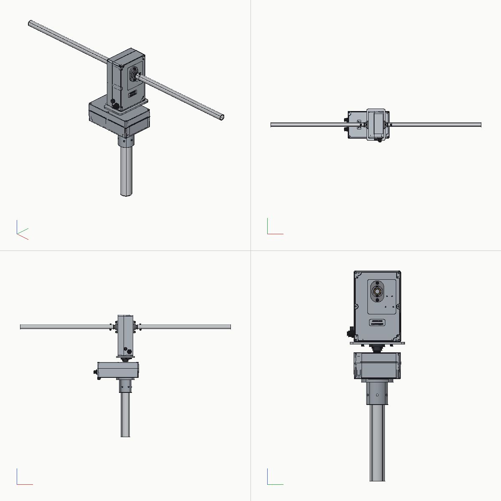
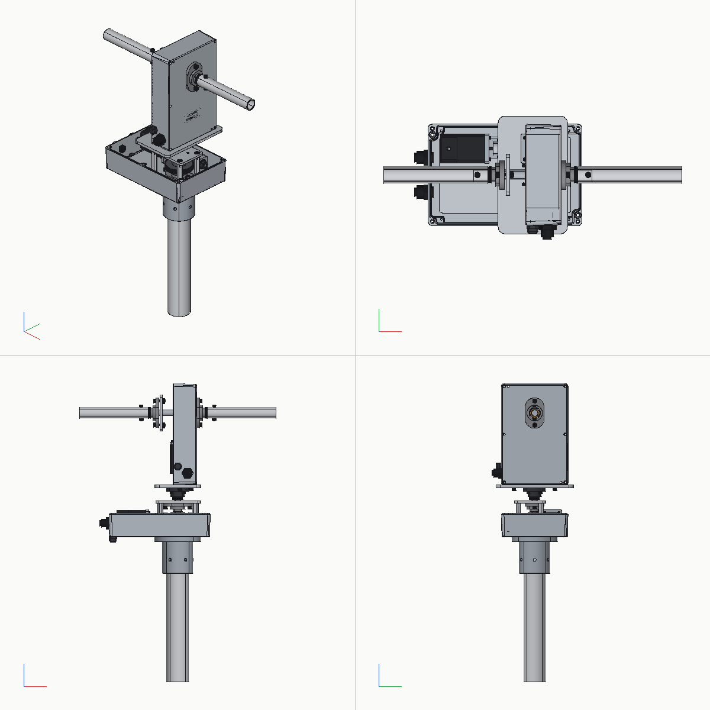
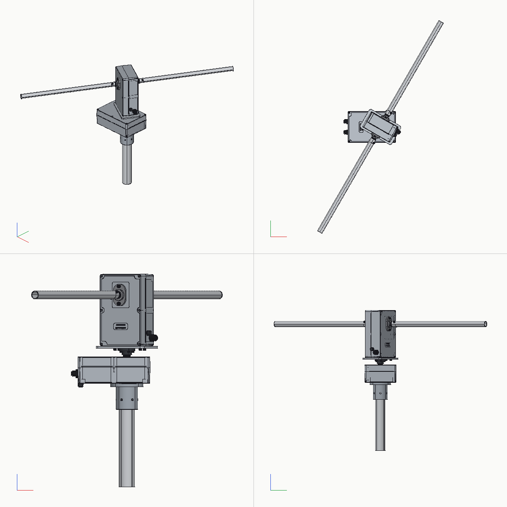

# Az/el antenna rotator

Weatherproof az/el rotator for small satellite yagis on a 25 mm crossboom, modelled in
[gcad](https://github.com/v0l/gcad). Housings are Hammond die-cast boxes; the made parts
are cut plates and a few turned and milled pieces, see `QUOTE.md`.







```sh
gcad rotator.gasm                         # viewer, joints `az` and `el`
gcad check rotator.gasm                   # build, interference and joint sweeps
gcad render rotator.gasm out.png --set cover=0   # without the two box lids
gcad bom rotator.gasm
gcad export rotator.gasm rotator.step
```

## Layout

- Two Hammond 1550Z220 die-cast IP66 boxes: the az box on the mast, the el box standing
  on the turret plate. Every other made part is a cut plate, two short turned shafts, the
  mast clamp and the two drive blocks.
- Az: 15 mm spindle in two KFL002 flange units, one on the chassis plate and one under a
  bearing plate on three standoffs. A flange collar on top carries the turret plate. The
  spindle leaves the lid through a V-ring.
- El: 15 mm shaft in KFL002 units bolted outside the el box floor and lid, with backing
  plates inside. Crossboom tubes slide over the shaft ends on bronze bushes and are cross-bolted.
- Each axis: KHK CG1-60R1 wheel on a keyed shaft, KHK SW1-R1 worm on an 8 mm shaft in two
  608s in `driveblock.gcad`, jaw-coupled to a dual-shaft NEMA17.
- Absolute magnetic encoder (AS5047P) on each motor's rear shaft; turn counting and
  its battery backup live on the driver board.
- The boxes are `parts/std/hammond_1550z220_box.gcad` and `_lid.gcad`. Without
  Hammond's STEP they are drawn from its measurements. Download the STEP from
  https://www.hammfg.com/part/1550Z220, save it as `parts/vendor/1550Z220.stp`, and run
  with `--set hammond=1` to drill the real boxes; `./export.sh` uses it when present.

## Sealing

The boxes seal on their own gaskets. Shafts leave through V-rings against the bearing
units or the lid, cables through IP68 M16 glands, and each box has an M12 breather vent.
The mast clamp seals the floor holes with a face O-ring.

## Ratings

60:1, 0.42 Nm motor, worm efficiency about 0.4: roughly 5 Nm usable at the output,
8-10 Nm at pull-out. KHK lists CG1-60R1 (cast iron) at 7.4 Nm at 100 rpm worm speed.
